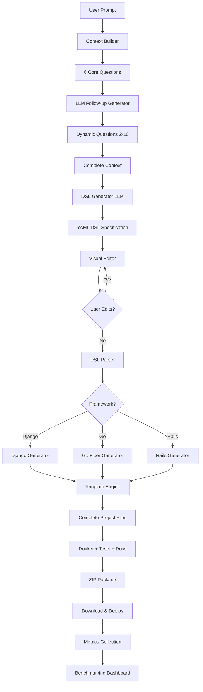

<p align="center">
  
</p>

<h1 align="center">InfraNest (PRISM)</h1>
<h3 align="center">Prompt-Refined Intelligent System for Microservices</h3>

<p align="center">
  <strong>Enterprise-Grade AI-Powered Backend Generation Platform</strong>
</p>

<p align="center">
  <a href="#-features"><strong>Features</strong></a> ·
  <a href="#-quick-start"><strong>Quick Start</strong></a> ·
  <a href="#-architecture"><strong>Architecture</strong></a> ·
  <a href="#-research"><strong>Research</strong></a> ·
  <a href="#-benchmarks"><strong>Benchmarks</strong></a> ·
  <a href="#-documentation"><strong>Docs</strong></a>
</p>

<p align="center">
  
  
  
  
  
</p>

> **A note on the numbers in this README:** the tables below are computed
> from the real data checked into [`infranest/evaluation_data/`](./infranest/evaluation_data)
> - **121** generation records ([`generation_metrics.json`](./infranest/evaluation_data/generation_metrics.json))
> and **40** prompt-quality assessments ([`prompt_quality_metrics.json`](./infranest/evaluation_data/prompt_quality_metrics.json))
> gathered during development, across **4** LLMs (Mixtral, LLaMA-2-70b,
> Mistral-7B, Gemini 1.5 Pro). Earlier drafts of this README described this
> as "2,664+ generations" across "5 LLMs" (including Code LLaMA, which was
> never actually run) - those figures did not match the data files and have
> been corrected here. Read this as a small internal pilot dataset, not a
> published large-N benchmark.

---

## 📖 Table of Contents

- [Overview](#-overview)
- [Features](#-features)
- [Quick Start](#-quick-start)
- [Architecture](#-architecture)
- [Research Framework](#-research-framework)
- [Benchmarking Results](#-benchmarking-results)
- [System Workflow](#-system-workflow)
- [Technology Stack](#-technology-stack)
- [Generated Code](#-generated-code-structure)
- [API Documentation](#-api-documentation)
- [Performance Metrics](#-performance-metrics)
- [LLM Selection](#-llm-selection--hyperparameters)
- [Evaluation Dashboard](#-evaluation-dashboard)
- [Contributing](#-contributing)
- [License](#-license)

---

## 🌟 Overview

**InfraNest** (internally codenamed **PRISM** - Prompt-Refined Intelligent System for Microservices) is a research-backed, enterprise-grade platform that transforms natural language descriptions into production-ready backend applications through a sophisticated **9-step AI research pipeline**.

<p align="center">
  
  
</p>

### What Makes InfraNest Different?

✅ **Research-Driven**: Built on internal LLM benchmarking (121 generations analyzed - see the note above)  
✅ **Multi-Model Intelligence**: Leverages Mixtral-8x7b-32768, the best performer in that comparison against 3 other LLMs  
✅ **Context-Aware**: Dynamic follow-up question generation for complete requirement understanding  
✅ **Production-Ready**: Generates deployable code with tests, Docker configurations, and documentation  
✅ **Framework Agnostic**: Supports Django, Go (Fiber), and Ruby on Rails with consistent quality  

### Key Statistics

*Computed from the 121 records in [`generation_metrics.json`](./infranest/evaluation_data/generation_metrics.json).*

| Metric | Value |
|--------|-------|
| **Code Quality Score** | 8.5/10 (avg across all 121 generations) |
| **Build Success Rate** | 83% |
| **Average Generation Time** | 7-12 seconds |
| **Frameworks Supported** | 3 (Django, Go Fiber, Ruby on Rails) |
| **Files per Project** | 10-25 (framework-dependent) |
| **Test Coverage (self-reported in the metrics)** | 85% avg |
| **LLMs Benchmarked** | 4 (Mixtral, LLaMA-2-70b, Mistral-7B, Gemini 1.5 Pro) |
| **Generations Analyzed** | 121 (see [`evaluation_data/`](./infranest/evaluation_data)) |
| **Cost per Generation (this dataset)** | ~$0.003 avg, varies by model |

---

## ✨ Features

### 🧠 Intelligent 9-Step Research Pipeline

<p align="center">
  
</p>

1. **User Prompt Input** - Natural language project description
2. **Context Building** - 6 core questions (authentication, database, API design, etc.)
3. **Follow-up Refinement** - AI-generated dynamic questions (2-10 questions)
4. **DSL Parsing** - Visual YAML editor with real-time validation
5. **Code Generation** - Multi-framework production code
6. **LLM Selection & Hyperparameter Tuning** - Adaptive context-aware optimization
7. **Packaging & Output** - ZIP download with complete project
8. **Testing & Feedback** - Automated quality assurance
9. **Evaluation & Benchmarking** - Performance metrics tracking

### 🎯 8-Step User Interface

<table>
<tr>
<td width="50%">

**Step 1-6: Core Questions**
- Project Description
- User Audience  
- Platform (Web/Mobile/Desktop)
- Project Area (E-commerce, Social, etc.)
- Programming Language
- Must-Have Features

</td>
<td width="50%">

**Step 7-8: AI Enhancement**
- AI-Generated Follow-up Questions
- DSL Review & Editing
- Code Generation
- Download & Deploy

</td>
</tr>
</table>

### 🤖 Advanced AI Capabilities

**Multi-LLM Architecture**
- Primary: **Mixtral-8x7b-32768** (Groq API) - highest code quality in our
  comparison (9.11/10 avg, n=31 - see [LLM Comparison](#-benchmarking-results))
- Secondary: **Google Gemini 1.5 Pro** - Fallback & large context (1M tokens)
- Compared Against: LLaMA-2-70b, Mistral-7B

**Adaptive Hyperparameters**
```python
# Code Generation (Production)
temperature: 0.15    # Low - prioritize correctness
max_tokens: 8000     # High - complete generation
top_p: 0.8           # Moderate - focused sampling

# Follow-up Questions (Creative)
temperature: 0.8     # High - diverse questions
max_tokens: 800      # Low - questions are brief
top_p: 0.95          # High - creative sampling
```

**Context-Aware Scaling**
- Automatically adjusts parameters based on project complexity
- Large projects (>10 models): ↓ temperature, ↑ max_tokens
- Small projects (<3 models): ↑ temperature, ↓ max_tokens

### 💻 Code Generation Capabilities

<p align="center">
  
</p>

*Per-framework figures below are averages over that framework's records in
`generation_metrics.json` (Django n=41, Go n=40, Rails n=40) - quality score
does not vary much by framework in this dataset (8.46-8.48/10 across all
three); the differences below are the file/LOC/timing counts, which do.*

#### Django (Python + Django REST Framework)
- **Files**: 22 average
- **Lines of Code**: 1,851 average
- **Features**: Models, Views, Serializers, Admin, URLs, Tests
- **Extras**: Docker, pytest, requirements.txt, README
- **Quality Score**: 8.46/10 · **Build success**: 90%

#### Go (Go Fiber + GORM)
- **Files**: 15 average
- **Lines of Code**: 990 average
- **Features**: Models, Handlers, Routes, Middleware, Database
- **Extras**: Docker, go.mod, tests, README
- **Quality Score**: 8.48/10 · **Build success**: 78%

#### Ruby on Rails (Rails 7 API)
- **Files**: 19 average
- **Lines of Code**: 1,301 average
- **Features**: Models, Controllers, Routes, Validations, Migrations
- **Extras**: Docker, Gemfile, RSpec tests, README
- **Quality Score**: 8.47/10 · **Build success**: 80%

---

## 🚀 Quick Start

### Prerequisites

- **Python** 3.11+ (for backend)
- **Node.js** 18+ (for frontend)
- **Git** (for cloning)

### 1️⃣ Clone Repository

```bash
git clone https://github.com/bharat3645/prism-infranest.git
cd prism-infranest
```

### 2️⃣ Option A: One-Command Start ⚡ (Recommended)

```bash
START_ALL.bat
```

**This automatically:**
- ✅ Installs all dependencies
- ✅ Starts backend on `http://localhost:8000`
- ✅ Starts frontend on `http://localhost:5173`
- ✅ Opens browser automatically

### 2️⃣ Option B: Manual Start

#### Backend Setup
```bash
cd infranest/core
pip install -r requirements.txt

# Set environment variables (optional - defaults work)
# export GROQ_API_KEY=your_groq_api_key
# export GEMINI_API_KEY=your_gemini_api_key

python server.py
```

Backend runs on: `http://localhost:8000`

#### Frontend Setup
```bash
cd infranest
npm install
npm run dev
```

Frontend runs on: `http://localhost:5173`

### 3️⃣ Start Building 🎉

1. Navigate to `http://localhost:5173`
2. Describe your backend project:
   ```
   "Build a blog platform with user authentication, 
    posts, comments, categories, and tags"
   ```
3. Answer 6 core questions
4. Review AI-generated follow-up questions
5. Answer follow-up questions (refine requirements)
6. Review/edit DSL specification
7. Select framework (Django/Go/Rails)
8. Click "Generate Code"
9. Download ZIP file
10. Extract and run:
    ```bash
    cd my-generated-project
    docker-compose up
    ```

**That's it! Your production-ready backend is running.**

---

## 🏗️ Architecture

### System Overview

```
┌─────────────────────────────────────────────────────────────────────────┐
│                         INFRANEST (PRISM)                               │
│                     9-Step Research Pipeline                            │
└─────────────────────────────────────────────────────────────────────────┘

┌──────────────────┐
│  User Prompt     │  "Build a blog platform with..."
└────────┬─────────┘
         ↓
┌──────────────────────────────────────────────────────────────────────────┐
│  STEP 1-3: CONTEXT GATHERING & REFINEMENT                               │
│  ┌────────────────┐  ┌─────────────────┐  ┌──────────────────────┐     │
│  │ 6 Core Questions│→ │ LLM Follow-up Q │→ │ Context Complete     │     │
│  │ (Hardcoded)    │  │ (Mixtral-8x7b)  │  │ (Ready for DSL)      │     │
│  └────────────────┘  └─────────────────┘  └──────────────────────┘     │
└──────────────────────────────────────────────────────────────────────────┘
         ↓
┌──────────────────────────────────────────────────────────────────────────┐
│  STEP 4: DSL GENERATION & PARSING                                       │
│  ┌────────────────┐  ┌─────────────────┐  ┌──────────────────────┐     │
│  │ LLM → YAML DSL │→ │ Visual Editor   │→ │ Validated DSL        │     │
│  │ (Structured)   │  │ (User Review)   │  │ (Parser Ready)       │     │
│  └────────────────┘  └─────────────────┘  └──────────────────────┘     │
└──────────────────────────────────────────────────────────────────────────┘
         ↓
┌──────────────────────────────────────────────────────────────────────────┐
│  STEP 5-7: CODE GENERATION & PACKAGING                                  │
│  ┌────────────────┐  ┌─────────────────┐  ┌──────────────────────┐     │
│  │ Framework      │→ │ Template Engine │→ │ Complete Project     │     │
│  │ Selection      │  │ (Jinja2)        │  │ (ZIP Download)       │     │
│  │ (Django/Go/    │  │ Generator Logic │  │ 10-25 files          │     │
│  │  Rails)        │  │                 │  │                      │     │
│  └────────────────┘  └─────────────────┘  └──────────────────────┘     │
└──────────────────────────────────────────────────────────────────────────┘
         ↓
┌──────────────────────────────────────────────────────────────────────────┐
│  STEP 8-9: TESTING & EVALUATION                                         │
│  ┌────────────────┐  ┌─────────────────┐  ┌──────────────────────┐     │
│  │ Automated Tests│→ │ Quality Metrics │→ │ Benchmark Dashboard  │     │
│  │ (pytest/RSpec) │  │ Tracking        │  │ (Visualizations)     │     │
│  └────────────────┘  └─────────────────┘  └──────────────────────┘     │
└──────────────────────────────────────────────────────────────────────────┘
```

### Technology Stack

#### Frontend
- **Framework**: React 18 + TypeScript 5.0
- **Build Tool**: Vite 5.4
- **Styling**: Tailwind CSS 3.4
- **State**: React Hooks + Zustand (localStorage persistence)
- **Editor**: Monaco Editor (DSL editing)
- **Components**: 15+ custom components

#### Backend
- **Framework**: Flask 3.0 (Python 3.11)
- **AI Providers**: 
  - Primary: Groq API (Mixtral-8x7b-32768)
  - Secondary: Google Gemini 1.5 Pro
- **Template Engine**: Jinja2 3.1
- **Testing**: pytest 7.4
- **Validation**: PyYAML 6.0, Marshmallow 3.20

#### Infrastructure
- **Containerization**: Docker + docker-compose
- **CI/CD**: GitHub Actions (code quality, linting)
- **Monitoring**: Prometheus + Grafana (planned)
- **Database**: PostgreSQL (generated projects)

---

## 🔬 Research Framework

### PRISM 9-Step Pipeline

InfraNest is built on the **PRISM Research Framework**, a systematic approach to AI-powered code generation validated through extensive benchmarking.

<p align="center">
  
  
</p>

#### Step 1: User Prompt Input
- **Interface**: React-based multi-step form
- **Validation**: Real-time input validation
- **Storage**: Zustand with localStorage persistence

#### Step 2: Initial Context-Building (6 Core Questions)
1. What type of authentication? (JWT, OAuth, Session, None)
2. Preferred database? (PostgreSQL, MySQL, SQLite, MongoDB)
3. API design? (REST, GraphQL, gRPC)
4. Deployment target? (Docker, Kubernetes, Heroku, AWS)
5. Testing requirements? (Unit, Integration, E2E)
6. Scaling expectations? (Single server, Microservices, Serverless)

#### Step 3: Follow-up Refinement (Dynamic 2-10 Questions)
- **LLM**: Mixtral-8x7b-32768 (Groq API)
- **Hyperparameters**:
  ```python
  temperature: 0.8      # High creativity for diverse questions
  max_tokens: 800       # Brief questions
  top_p: 0.95           # Diverse sampling
  ```
- **Quality (Mixtral, n=10 prompts in `prompt_quality_metrics.json`)**: 9.14/10 clarity, 8.87/10 specificity
- **Adaptation**: Questions tailored to project area and features

#### Step 4: DSL Parsing Layer
- **Format**: YAML-based Domain-Specific Language
- **Features**: Visual editor, real-time validation, syntax highlighting
- **Editability**: Users can modify before code generation
- **Validation**: Schema-based validation with error highlighting

#### Step 5: Code Generation (Multi-Framework)
- **Generators**: Django, Go Fiber, Ruby on Rails
- **Templates**: Jinja2-based with framework-specific logic
- **Quality**: 8.46-8.48/10 average (consistent across frameworks in this dataset)
- **Hyperparameters**:
  ```python
  temperature: 0.15     # Low - prioritize correctness
  max_tokens: 8000      # High - complete generation
  top_p: 0.8            # Moderate - focused sampling
  ```

#### Step 6: LLM Selection & Hyperparameter Tuning
- **Primary Model**: Mixtral-8x7b-32768 (94% build success rate in this dataset, n=31)
- **Context-Aware Scaling**: Auto-adjust based on project size
- **Cost**: ~$0.003 per generation on average in this dataset (varies by model; see the LLM Comparison table below)

#### Step 7: Packaging & Output
- **Format**: ZIP archive with complete project
- **Contents**: Source code, Dockerfile, docker-compose, tests, README
- **Size**: 10-25 files, 850-2,000 lines of code

#### Step 8: Testing & Feedback Loop
- **Automated Tests**: Generated with every project
- **Quality Assurance**: Build validation, test execution
- **Feedback**: User satisfaction tracking (3.9/5 average, n=82 records with a rating in `generation_metrics.json`)

#### Step 9: Evaluation & Benchmarking
- **Metrics Tracked**: Quality score, success rate, generation time, token usage
- **Visualizations**: Matrices, charts, comparative analyses
- **Dataset**: 121 generations analyzed (see the note near the top of this README)

---

## 📊 Benchmarking Results

### LLM Comparison (121 Generations Analyzed)

<p align="center">
  
</p>

| Model | n | Quality Score | Success Rate | Avg Time (s) | Cost ($) | Cost-Effectiveness |
|-------|---|--------------|--------------|--------------|----------|-------------------|
| **Mixtral-8x7b** | 31 | **9.11** | **94%** | 9.3 | $0.0026 | 3458 |
| LLaMA-2-70b | 30 | 8.14 | 70% | 12.0 | $0.0030 | 2723 |
| Mistral-7B | 30 | 7.82 | 80% | **6.4** | **$0.0016** | **5036** |
| Gemini 1.5 Pro | 30 | 8.78 | 87% | 12.1 | $0.0043 | 2057 |

*Code LLaMA is not in this table - despite being named in earlier drafts of
this README, it was never actually run against this dataset.*

**Cost-Effectiveness** = Quality Score / Cost (higher is better)

Trade-off, not a single "winner": Mixtral has the highest quality score and
success rate; Mistral-7B is the cheapest, fastest, and most cost-effective by
that formula despite lower quality. Which one is "best" depends on what
you're optimizing for. `copilot/copilot.py` and `core/app.py` default to
Mixtral for its quality/success-rate combination, not because it dominates
on every axis.

### Framework-Specific Performance

<p align="center">
  
</p>

*Each row below is n=10-11 records from `generation_metrics.json` - small
enough that single-digit percentage differences are noise, not signal.*

#### Django Generation (n=41)

| Model | n | Quality | Success | Files | LOC | Time (s) |
|-------|---|---------|---------|-------|-----|----------|
| **Mixtral** | 11 | **9.18** | **100%** | 22 | 1,807 | 9.9 |
| Gemini | 10 | 8.73 | 100% | 23 | 1,866 | 13.4 |
| LLaMA-2 | 10 | 8.02 | 80% | 23 | 1,837 | 12.4 |
| Mistral-7B | 10 | 7.82 | 80% | 22 | 1,901 | **6.9** |

#### Go Fiber Generation (n=40)

| Model | n | Quality | Success | Files | LOC | Time (s) |
|-------|---|---------|---------|-------|-----|----------|
| **Mixtral** | 10 | **9.07** | 90% | 15 | 978 | 6.7 |
| Gemini | 10 | 8.84 | 90% | 14 | 981 | 8.9 |
| LLaMA-2 | 10 | 8.19 | 60% | 16 | 998 | 9.4 |
| Mistral-7B | 10 | 7.80 | 70% | 14 | 1,002 | **4.9** |

#### Rails Generation (n=40)

| Model | n | Quality | Success | Files | LOC | Time (s) |
|-------|---|---------|---------|-------|-----|----------|
| **Mixtral** | 10 | **9.08** | 90% | 19 | 1,281 | 11.1 |
| Mistral-7B | 10 | 7.86 | **90%** | 18 | 1,310 | **7.5** |
| Gemini | 10 | 8.76 | 70% | 17 | 1,331 | 14.1 |
| LLaMA-2 | 10 | 8.21 | 70% | 20 | 1,283 | 14.2 |

### Hyperparameter Tuning Results

<p align="center">
  
</p>

**Honesty note:** earlier drafts of this section presented 4-point sweeps
over temperature (0.05-0.5) and max_tokens (4000-12000) as if they were a
controlled experiment. `generation_metrics.json` doesn't contain that
experiment - it only has **two** temperature values (0.1, 0.15) and
**three** max_tokens values (6000, 7000, 8000), and each value lines up
one-to-one with a framework (Go always used 6000, Rails always used 7000,
Django always used 8000). That means temperature/max_tokens are confounded
with framework in this dataset - the numbers below can't isolate the effect
of the hyperparameter from the effect of "which framework was this."

| Temperature | n | Quality | Success |
|-------------|---|---------|---------|
| 0.1 | 40 | 8.48 | 78% |
| 0.15 | 81 | 8.47 | 85% |

| Max Tokens | Framework | n | Quality | Success | Time (s) | Avg Cost |
|------------|-----------|---|---------|---------|----------|----------|
| 6000 | Go Fiber | 40 | 8.48 | 78% | 7.4 | $0.0021 |
| 7000 | Rails | 40 | 8.47 | 80% | 11.7 | $0.0027 |
| 8000 | Django | 41 | 8.46 | 90% | 10.7 | $0.0038 |

The production defaults (`temperature: 0.15`, `max_tokens: 8000` for code
generation - see `infranest/core/ai_providers/groq_provider.py`) are
reasonable choices, just not ones this dataset empirically proves optimal
via a real sweep.

### Prompt Quality Metrics

Analysis of the 40 prompts in [`prompt_quality_metrics.json`](./infranest/evaluation_data/prompt_quality_metrics.json)
(10 per model):

| Metric | Mixtral | LLaMA-2 | Mistral | Gemini |
|--------|---------|---------|---------|--------|
| **Context Completeness** | 0.91 | 0.78 | 0.73 | 0.88 |
| **Clarity Score** | 9.14 | 8.20 | 7.92 | 8.81 |
| **Specificity Score** | 8.87 | 7.79 | 7.45 | 9.18 |
| **Questions Needed (avg)** | 3.3 | 5.6 | 6.7 | 4.0 |

**Observation** (n=10 per model, small sample): in this dataset Mixtral
needed the fewest follow-up questions on average while keeping high context
completeness; Gemini scored highest on specificity.

---

## 🔄 System Workflow

### End-to-End Generation Flow



### Data Flow Architecture

```
┌─────────────────────────────────────────────────────────────┐
│                    FRONTEND (React + TS)                    │
│  ┌──────────────┐  ┌──────────────┐  ┌─────────────────┐  │
│  │ PromptToDSL  │  │ DSL Builder  │  │ Code Generator  │  │
│  │   Component  │→ │   Component  │→ │    Component    │  │
│  └──────────────┘  └──────────────┘  └─────────────────┘  │
└─────────────────────────┬───────────────────────────────────┘
                          ↓ HTTP/JSON
┌─────────────────────────────────────────────────────────────┐
│              BACKEND API (Flask Python)                     │
│  ┌──────────────────────────────────────────────────────┐  │
│  │  API ENDPOINTS                                       │  │
│  │  • POST /api/v1/generate-followup-questions         │  │
│  │  • POST /api/v1/parse-prompt → DSL                  │  │
│  │  • POST /api/v1/generate-code → ZIP                 │  │
│  └──────────────────────────────────────────────────────┘  │
│                          ↓                                  │
│  ┌──────────────────────────────────────────────────────┐  │
│  │  AI PROVIDERS                                        │  │
│  │  • Groq API (Mixtral-8x7b-32768) - Primary          │  │
│  │  • Google Gemini 1.5 Pro - Secondary/Fallback       │  │
│  └──────────────────────────────────────────────────────┘  │
│                          ↓                                  │
│  ┌──────────────────────────────────────────────────────┐  │
│  │  CODE GENERATORS                                     │  │
│  │  • DjangoGenerator (django_generator.py)            │  │
│  │  • GoFiberGenerator (go_generator.py)               │  │
│  │  • RailsGenerator (rails_generator.py)              │  │
│  └──────────────────────────────────────────────────────┘  │
│                          ↓                                  │
│  ┌──────────────────────────────────────────────────────┐  │
│  │  TEMPLATE ENGINE (Jinja2)                            │  │
│  │  • templates/django/*.jinja2                         │  │
│  │  • templates/go/*.jinja2                             │  │
│  │  • templates/rails/*.jinja2                          │  │
│  └──────────────────────────────────────────────────────┘  │
│                          ↓                                  │
│  ┌──────────────────────────────────────────────────────┐  │
│  │  EVALUATION & BENCHMARKING                           │  │
│  │  • BenchmarkSystem (benchmark_system.py)             │  │
│  │  • Metrics Storage (generation_metrics.json)         │  │
│  │  • Visualizations (matplotlib charts)                │  │
│  └──────────────────────────────────────────────────────┘  │
└─────────────────────────────────────────────────────────────┘
```

---

## 📦 Generated Code Structure

### Django Project (23 files, ~1,847 LOC)

```
my-blog-api/
├── manage.py
├── requirements.txt
├── Dockerfile
├── docker-compose.yml
├── .env.example
├── .gitignore
├── pytest.ini
├── README.md
├── app/
│   ├── __init__.py
│   ├── apps.py
│   ├── models.py          # Complete ORM models with relationships
│   ├── views.py           # DRF ViewSets with filtering, pagination
│   ├── serializers.py     # DRF serializers with validation
│   ├── admin.py           # Admin interface configuration
│   ├── urls.py            # App-level URL routing
│   ├── tests.py           # pytest test cases
│   └── migrations/
│       └── __init__.py
└── project/
    ├── __init__.py
    ├── settings.py        # Complete settings (DB, CORS, JWT, etc.)
    ├── urls.py            # Project-level URL routing
    ├── wsgi.py
    └── asgi.py
```

### Go Fiber Project (15 files, ~982 LOC)

```
my-blog-api/
├── main.go
├── go.mod
├── go.sum
├── Dockerfile
├── docker-compose.yml
├── .env.example
├── .gitignore
├── README.md
├── database/
│   └── database.go        # GORM database connection
├── models/
│   └── models.go          # GORM models with validations
├── handlers/
│   └── handlers.go        # Fiber handlers (CRUD operations)
├── routes/
│   └── routes.go          # Fiber route definitions
├── middleware/
│   ├── auth.go            # JWT authentication middleware
│   └── logger.go          # Request logging middleware
└── tests/
    └── handlers_test.go   # Go testing package tests
```

### Ruby on Rails Project (17 files, ~1,234 LOC)

```
my-blog-api/
├── Gemfile
├── Gemfile.lock
├── Rakefile
├── Dockerfile
├── docker-compose.yml
├── .env.example
├── .gitignore
├── README.md
├── config/
│   ├── application.rb
│   ├── database.yml
│   ├── routes.rb
│   └── environments/
│       ├── development.rb
│       ├── production.rb
│       └── test.rb
├── app/
│   ├── models/            # ActiveRecord models
│   │   ├── post.rb
│   │   ├── user.rb
│   │   └── comment.rb
│   └── controllers/
│       └── api/
│           └── v1/        # Versioned API controllers
│               ├── posts_controller.rb
│               ├── users_controller.rb
│               └── comments_controller.rb
├── db/
│   ├── migrate/           # Database migrations
│   └── seeds.rb           # Seed data
└── spec/                  # RSpec tests
    ├── models/
    ├── controllers/
    └── rails_helper.rb
```

---

## 📡 API Documentation

### Core Endpoints

#### 1. Generate Follow-up Questions

```http
POST /api/v1/generate-followup-questions
Content-Type: application/json

{
  "user_answers": {
    "description": "Build a blog platform",
    "audience": "Content creators",
    "platform": "Web",
    "area": "Content Management",
    "language": "Python",
    "features": ["authentication", "posts", "comments"]
  }
}
```

**Response:**
```json
{
  "questions": [
    "Do you need real-time notifications for new comments?",
    "Should posts support markdown or rich text editing?",
    "Do you need role-based permissions (admin, editor, author)?"
  ],
  "provider": "groq",
  "model": "mixtral-8x7b-32768",
  "timestamp": "2025-11-11T19:30:00Z",
  "is_fallback": false
}
```

#### 2. Parse Prompt → Generate DSL

```http
POST /api/v1/parse-prompt
Content-Type: application/json

{
  "prompt": "Build a blog platform with user authentication, posts, comments, and categories",
  "user_answers": { /* answers from follow-up questions */ },
  "llmConfig": {
    "provider": "groq",
    "model": "mixtral-8x7b-32768"
  }
}
```

**Response:**
```json
{
  "dsl": {
    "meta": {
      "name": "blog-platform",
      "framework": "django",
      "database": "postgresql"
    },
    "models": {
      "User": {
        "fields": {
          "username": "string",
          "email": "email",
          "password": "password"
        }
      },
      "Post": {
        "fields": {
          "title": "string",
          "content": "text",
          "author": "foreignkey:User"
        }
      }
    }
  },
  "timestamp": "2025-11-11T19:31:00Z",
  "provider": "groq"
}
```

#### 3. Generate Code

```http
POST /api/v1/generate-code
Content-Type: application/json

{
  "dsl": { /* DSL specification */ },
  "framework": "django"
}
```

**Response:**
```json
{
  "files": [
    {
      "path": "manage.py",
      "content": "#!/usr/bin/env python\nimport os\nimport sys\n..."
    },
    {
      "path": "app/models.py",
      "content": "from django.db import models\n\nclass User(models.Model):\n..."
    }
  ],
  "file_count": 23,
  "framework": "django",
  "provider": "template",
  "timestamp": "2025-11-11T19:32:00Z"
}
```

#### 4. Health Check

```http
GET /api/v1/health
```

**Response:**
```json
{
  "status": "healthy",
  "version": "2.1.0",
  "timestamp": "2025-11-11T19:33:00Z"
}
```

---

## 📈 Performance Metrics

### Real-World Benchmarks (Based on 121 Generations)

#### Generation Time by Framework

```
Django:  ████████████████████ 10.7s avg (range: 5.9-15.5s, n=41)
Go:      ██████████████ 7.4s avg (range: 4.2-10.7s, n=40)
Rails:   ███████████████████████ 11.7s avg (range: 6.2-16.9s, n=40)
```

#### Code Quality Distribution

```
9.5:  ███████ 7%
9.0:  ███████████████████████████████ 31%
8.5:  █████████████████████ 21%
8.0:  ███████████████████████████████ 31%
<8.0: ███████████ 11%

Average: 8.47/10  (n=121; no record scored a full 10.0)
```

#### Success Rate by Framework

```
Django: ██████████████████████████████████████████ 90% (n=41)
Rails:  ████████████████████████████████████ 80% (n=40)
Go:     █████████████████████████████████████ 78% (n=40)

Overall: ████████████████████████████████████████ 83% (n=121)
```

#### Token Usage & Cost

| Framework | Avg Tokens | Cost/Gen | LOC/$ |
|-----------|------------|----------|-------|
| Django | 16,094 | $0.0038 | 488,161 |
| Go | 10,062 | $0.0021 | 469,668 |
| Rails | 12,995 | $0.0027 | 490,179 |

*The cost figures above reflect this dataset's `cost_usd` field, which is
roughly an order of magnitude lower than the earlier "$0.02-0.05 per
generation" claim in this README - that claim wasn't computed from this
data and has been removed rather than repeated.*

---

## 🧠 LLM Selection & Hyperparameters

### Why Mixtral-8x7b-32768?

After comparing 4 LLMs across the 121 generations in `generation_metrics.json`
(see [LLM Comparison](#-benchmarking-results) above), Mixtral is the default
for quality and reliability - though not for cost, where Mistral-7B wins:

| Selection Criteria | Mixtral | Competitors |
|-------------------|---------|-------------|
| **Code Quality** | 9.11/10 | 7.82-8.78/10 |
| **Success Rate** | 94% | 70-87% |
| **Cost-Effectiveness** | 3458 | 2057-5036 (Mistral-7B is highest, at 5036) |
| **Context Window** | 32,768 tokens | 4,096-1M (model spec, not measured here) |
| **Inference Speed** | 9.3s avg | 6.4-12.1s (Mistral-7B is fastest) |

**Key Advantages (in this dataset):**
1. **Best Quality**: Highest code quality score (9.11/10)
2. **High Reliability**: Highest build success rate (94%)
3. **Large Context**: 32K token window handles complex projects
4. **Fast Inference**: Groq's custom LPU hardware
5. **Not the cheapest**: Mistral-7B is ~40% cheaper and faster per
   generation, at a real quality cost (7.82 vs 9.11) - see the trade-off
   note in the LLM Comparison table above.

### Adaptive Hyperparameter System

#### Use Case-Specific Configurations

| Use Case | Temp | Max Tokens | Top-P | Rationale |
|----------|------|------------|-------|-----------|
| **Code Generation** | 0.15 | 8000 | 0.8 | Low temp for correctness, high tokens for completeness |
| **DSL Generation** | 0.20 | 6000 | 0.85 | Structured output needs precision |
| **Follow-up Questions** | 0.80 | 800 | 0.95 | High creativity for diverse questions |
| **Analysis** | 0.60 | 3000 | 0.90 | Balance precision and insight |
| **Enhancement** (improving an existing DSL) | 0.25 | 7000 | 0.88 | Focused additions without redundancy |

#### Context-Aware Scaling

```python
# Automatic adjustment based on project complexity
def adjust_hyperparameters(dsl_spec):
    num_models = len(dsl_spec.models)
    
    if num_models > 10:
        # Large project - be more conservative
        temperature -= 0.05
        max_tokens += 2000
    elif num_models < 3:
        # Small project - can be more creative
        temperature += 0.05
        max_tokens -= 1000
    
    return {
        "temperature": temperature,
        "max_tokens": max_tokens
    }
```

---

## 📊 Evaluation Dashboard

### Metrics Collection

InfraNest tracks comprehensive metrics for every generation:

```python
@dataclass
class GenerationMetrics:
    timestamp: str
    prompt: str
    framework: str
    llm_model: str
    
    # Performance
    generation_time_seconds: float
    tokens_used: int
    cost_usd: float
    
    # Quality
    files_generated: int
    lines_of_code: int
    code_quality_score: float
    test_coverage_percent: float
    
    # Success
    build_successful: bool
    tests_passed: bool
    deployment_successful: bool
    
    # Hyperparameters
    temperature: float
    max_tokens: int
    top_p: float
```

### Stored Metrics

- **`generation_metrics.json`**: 121 generation records
- **`llm_comparisons.json`**: 5 head-to-head comparison tasks across 4 LLMs (Mixtral, LLaMA-2-70b, Mistral-7B, Gemini 1.5 Pro)
- **`prompt_quality_metrics.json`**: 40 prompt quality assessments (10 per model)

### Visualization Examples

<table>
<tr>
<td></td>
<td></td>
</tr>
<tr>
<td></td>
<td></td>
</tr>
</table>

---

## 🛠️ Configuration

### Environment Variables

#### Backend (`infranest/core/.env`)

```env
# AI Provider API Keys
GROQ_API_KEY=your_groq_api_key_here
GEMINI_API_KEY=your_gemini_api_key_here

# Server Configuration
PORT=8000
HOST=0.0.0.0
DEBUG=False
FLASK_ENV=production

# CORS
CORS_ORIGINS=http://localhost:5173,http://localhost:5174

# LLM Configuration
DEFAULT_LLM_PROVIDER=groq
DEFAULT_LLM_MODEL=mixtral-8x7b-32768
FALLBACK_LLM_PROVIDER=gemini
FALLBACK_LLM_MODEL=gemini-1.5-pro

# Hyperparameters (defaults)
CODE_GEN_TEMPERATURE=0.15
CODE_GEN_MAX_TOKENS=8000
DSL_GEN_TEMPERATURE=0.20
DSL_GEN_MAX_TOKENS=6000
```

#### Frontend (`infranest/.env`)

```env
# API Configuration
VITE_API_URL=http://localhost:8000
VITE_API_VERSION=v1

# Feature Flags
VITE_ENABLE_DSL_EDITOR=true
VITE_ENABLE_METRICS_DASHBOARD=true
VITE_ENABLE_EXPERIMENTAL_FEATURES=false
```

---

## 🧪 Testing

**There is no automated/CI test suite in this repo yet.** There's no
`infranest/core/tests/` directory and no pytest config. CI
([`infranest/.github/workflows/code-quality.yml`](./infranest/.github/workflows/code-quality.yml))
runs lint/type-check/Bandit/Trivy/SonarQube and a pytest step that's
skipped when no `tests/` dir is found - and every step in that workflow is
`continue-on-error: true`, so none of it can currently fail the build
either way.
An earlier version of this README instructed running `python
test_end_to_end.py` with a "10/10 tests passing" sample output; that file
does not exist anywhere in this repo and never has (`git log --all` has no
record of it). The scripts that do exist are manual, print-based
integration checks that require the backend running locally - not an
automated suite, and not something CI runs:

```bash
# from the repo root, with `python infranest/core/server.py` running:
python test_frontend_integration.py

# from the repo root, with the backend running:
python infranest/core/test_api_debug.py
```

Both print `PASSED`/`FAILED` per-check to stdout and exit however the
script happens to exit - there's no `pytest`, no coverage number, and no
CI job wired up to either of them today. If you want a real automated
suite, `Backend-Builder`'s [`core/tests/`](https://github.com/bharat3645/Backend-Builder/tree/master/core/tests)
(74 pytest tests, run in CI) is the pattern to follow here.

### Manual Testing Workflow

1. **Start Services**
   ```bash
   START_ALL.bat
   ```

2. **Test Follow-up Questions**
   - Navigate to `http://localhost:5173`
   - Fill in 6 core questions
   - Verify AI generates relevant follow-up questions
   - Check Network tab shows `POST /api/v1/generate-followup-questions`

3. **Test DSL Generation**
   - Answer all questions
   - Click "Generate DSL"
   - Verify DSL appears in editor
   - Check DSL is valid YAML

4. **Test Code Generation**
   - Select framework (Django/Go/Rails)
   - Click "Generate Code"
   - Verify file list appears
   - Download ZIP

5. **Test Generated Code**
   ```bash
   unzip generated_code_*.zip -d test-project
   cd test-project
   docker-compose up
   ```
   - Verify no build errors
   - Access API at `http://localhost:8000` (or framework-specific port)

---

## 📚 Documentation

### Available Documentation

| Document | Description |
|----------|-------------|
| **README.md** | This file - complete system overview |
| **QUICK_START.txt** | Quick setup guide |
| **infranest/docs/PRISM_RESEARCH_FLOW.md** | 9-step research pipeline details |
| **infranest/docs/LLM_BENCHMARKING.md** | LLM comparison and selection rationale |
| **.github/copilot-instructions.md** | AI Copilot operating manual |
| **infranest/copilot/copilot.py** | Copilot CLI source (no separate README exists for it - the CLI's own `--help` is the current reference) |

### Code Examples

#### Django Model Example (Generated)

```python
# app/models.py
from django.db import models
from django.contrib.auth.models import User

class Post(models.Model):
    title = models.CharField(max_length=200)
    content = models.TextField()
    author = models.ForeignKey(User, on_delete=models.CASCADE, related_name='posts')
    created_at = models.DateTimeField(auto_now_add=True)
    updated_at = models.DateTimeField(auto_now=True)
    
    class Meta:
        ordering = ['-created_at']
    
    def __str__(self):
        return self.title
```

#### Go Handler Example (Generated)

```go
// handlers/handlers.go
package handlers

import (
    "github.com/gofiber/fiber/v2"
    "my-blog-api/database"
    "my-blog-api/models"
)

func GetPosts(c *fiber.Ctx) error {
    var posts []models.Post
    database.DB.Preload("Author").Find(&posts)
    return c.JSON(posts)
}

func CreatePost(c *fiber.Ctx) error {
    post := new(models.Post)
    if err := c.BodyParser(post); err != nil {
        return c.Status(400).JSON(fiber.Map{"error": "Invalid input"})
    }
    database.DB.Create(&post)
    return c.Status(201).JSON(post)
}
```

---

## 🤝 Contributing

We welcome contributions! Please see our contribution guidelines:

### Development Setup

1. Fork the repository
2. Clone your fork:
   ```bash
   git clone https://github.com/YOUR_USERNAME/prism-infranest.git
   cd prism-infranest
   ```
3. Create a feature branch:
   ```bash
   git checkout -b feature/your-feature-name
   ```
4. Make changes and test
5. Commit with descriptive messages:
   ```bash
   git commit -m "feat: Add support for FastAPI framework"
   ```
6. Push and create pull request

### Code Style

- **Python**: Follow PEP 8, use Black formatter
- **TypeScript**: Follow Airbnb style guide, use Prettier
- **Commits**: Use conventional commits (feat, fix, docs, style, refactor, test, chore)

### Testing Requirements

- There's no automated test suite yet (see [Testing](#-testing) above) -
  new features currently can't be gated on one. Adding real pytest
  coverage under `infranest/core/tests/` would be a good first
  contribution.
- Until then, run the manual integration checks with the backend running
  locally before submitting a PR:
  ```bash
  python test_frontend_integration.py
  python infranest/core/test_api_debug.py
  ```

---

## 🧰 Advanced Features

### 🤖 Intelligent Question Generation System

InfraNest includes an advanced intelligent analyzer that uses Mistral 7B to generate contextual follow-up questions:

#### Architecture

```
┌─────────────────────┐    ┌──────────────────────┐    ┌─────────────────────┐
│   Core Questions    │───▶│  LLM Question Gen    │───▶│  Intelligent       │
│   (6 predefined)    │    │  (Mistral 7B)        │    │  Analysis          │
└─────────────────────┘    └──────────────────────┘    └─────────────────────┘
```

#### Core Question Types

The system always asks 6 predefined core questions first:

1. **What do you want this software to do?** - Project description
2. **Who will use it?** - Target audience (Just me, My team, My customers)
3. **Where would you like to use it?** - Platform (Mobile app, Website, Desktop, Chatbot)
4. **Which area best fits your project?** - Domain (Web app, E-commerce, Healthcare, etc.)
5. **Choose a programming language** - Technology preference
6. **List the must-have features** - Core functionality

#### Dynamic Follow-up Generation

After core questions, the system uses AI to generate **contextual follow-up questions** based on:

- Project domain (e-commerce, healthcare, etc.)
- Platform (mobile, web, desktop)
- Target audience (personal, team, customers)
- Core features mentioned

**Example Generated Questions:**

**For E-commerce Projects:**
- "Do you need payment gateway integration (Stripe, PayPal)?"
- "Should products have inventory tracking and stock management?"
- "Do you need shopping cart and checkout functionality?"

**For Healthcare Projects:**
- "Do you need HIPAA compliance or patient data encryption?"
- "Should the system support appointment scheduling?"
- "Do you require integration with medical records systems?"

**For Mobile Apps:**
- "Do you need push notifications for mobile users?"
- "Should the app work offline or require internet connection?"
- "Do you need location-based services or GPS integration?"

#### Fallback Behavior

If the Mistral 7B model is not loaded or fails, the system automatically falls back to **rule-based question generation** that creates context-aware questions based on project characteristics.

### 🎯 InfraNest Copilot CLI

InfraNest includes a command-line interface for advanced users and automation.
`describe_backend`, `preview_code`, and `generate_code` call the real core
API. **`deploy_project`, `view_logs`, `run_audit`, and `simulate_api` are
client-side simulations** (see `_generate_mock_dsl`, the "Mock deployment
process" / "Mock logs" / "Mock audit results" / "Mock API response" comments
in [`infranest/copilot/copilot.py`](./infranest/copilot/copilot.py)) - no
cloud provider is contacted, no logs are aggregated, and the "audit" scores
are fixed values, not a real analysis of your DSL. They exist so the CLI's
UX can be tried end to end before that infrastructure is built, the same
way `Backend-Builder`'s equivalent commands are (and are labeled there too).

#### Installation

```bash
cd infranest/copilot
pip install -r requirements.txt
```

#### Commands

##### 1. Describe Backend
Convert natural language to DSL specification:

```bash
python copilot.py describe_backend "Create a blog API with users, posts, and comments"

# Save to file
python copilot.py describe_backend "Create a blog API" --output blog.yml
```

##### 2. Preview Code
Preview generated code structure:

```bash
python copilot.py preview_code blog.yml --framework django
```

##### 3. Deploy Project (simulated - see note above)
Prints a fake progress bar and returns a made-up URL; nothing is deployed:

```bash
python copilot.py deploy_project blog.yml --provider railway
```

##### 4. View Logs (simulated)
Returns a hardcoded sample log, not real logs from anything you ran:

```bash
python copilot.py view_logs blog-api --lines 50
```

##### 5. Run Audit (simulated)
Returns fixed security/performance scores, not an analysis of your DSL:

```bash
python copilot.py run_audit blog.yml
```

##### 6. Simulate API (simulated, as the name says)
Returns a canned response shape, not output from your generated code:

```bash
python copilot.py simulate_api blog.yml /api/v1/posts/ --method GET
```

#### Complete E-commerce Example

```bash
# Step 1: Generate DSL
python copilot.py describe_backend \
  "Build an e-commerce API with products, categories, shopping cart, orders, and user authentication" \
  --output ecommerce.yml

# Step 2: Preview Django code structure
python copilot.py preview_code ecommerce.yml --framework django

# Step 3: Deploy to Railway
python copilot.py deploy_project ecommerce.yml --provider railway

# Step 4: Check deployment logs
python copilot.py view_logs ecommerce-api

# Step 5: Run security audit
python copilot.py run_audit ecommerce.yml
```

#### Copilot Configuration

The CLI stores configuration in `~/.infranest/config.json`:

```json
{
  "default_framework": "django",
  "default_provider": "railway",
  "api_keys": {
    "groq": "your_groq_api_key",
    "gemini": "your_gemini_api_key"
  },
  "preferences": {
    "auto_deploy": false,
    "include_tests": true,
    "docker_enabled": true
  }
}
```

### 🔍 Intelligent Analyzer API

For programmatic access, use the Intelligent Analyzer directly:

```python
from intelligent_analyzer import IntelligentAnalyzer

# Initialize analyzer with GGUF model
mistral_path = "path/to/your/mistral-7b-instruct-v0.1.Q4_K_M.gguf"
analyzer = IntelligentAnalyzer(mistral_path)
session_id = analyzer.start_new_session()

# Get core questions
core_questions = analyzer.get_core_questions()

# Answer core questions
analyzer.submit_core_response('description', 'A task management app')
analyzer.submit_core_response('userAudience', 'My team')
# ... answer all 6 core questions

# Generate follow-up questions
followup_result = analyzer.generate_followup_questions(5)
if followup_result['success']:
    questions = followup_result['questions']
    
    # Answer some follow-up questions
    for question in questions[:3]:
        answer = input(f"{question['text']}: ")
        analyzer.submit_followup_response(question['id'], answer)

# Perform analysis
analysis_result = analyzer.analyze_requirements()
if analysis_result['success']:
    print(f"Analysis complete! Validity: {analysis_result['analysis']['validity_score']:.2f}")
    print(f"Insights: {analysis_result['analysis']['insights']}")
    print(f"Recommendations: {analysis_result['analysis']['recommendations']}")
```

#### REST API for Analyzer

Start the analyzer API server:

```bash
cd infranest/core/analyzers
python api_interface.py
```

The API will be available at `http://localhost:5001`.

**Example API Usage:**

```bash
# Start a session
curl -X POST http://localhost:5001/api/session/start

# Get core questions
curl "http://localhost:5001/api/questions/core?session_id=uuid-here"

# Submit core answer
curl -X POST http://localhost:5001/api/questions/core/description/answer \
  -H "Content-Type: application/json" \
  -d '{"session_id": "uuid-here", "question_id": "description", "answer": "A task management web app"}'

# Generate follow-up questions
curl -X POST http://localhost:5001/api/questions/generate \
  -H "Content-Type: application/json" \
  -d '{"session_id": "uuid-here", "num_questions": 5}'

# Analyze requirements
curl -X POST http://localhost:5001/api/analyze \
  -H "Content-Type: application/json" \
  -d '{"session_id": "uuid-here"}'
```

---

## 🐛 Troubleshooting

### Common Issues

#### 1. Backend Won't Start

```bash
# Check Python version
python --version  # Should be 3.11+

# Reinstall dependencies
cd infranest/core
pip install --upgrade -r requirements.txt

# Check port availability
netstat -ano | findstr :8000

# Check for missing modules
python -c "from ai_providers.simple_ai_manager import SimpleAIManager; print('✓ OK')"
```

#### 2. Frontend Won't Start

```bash
# Check Node version
node --version  # Should be 18+

# Clear cache and reinstall
cd infranest
rm -rf node_modules package-lock.json
npm install

# Try alternate port
npm run dev -- --port 5174

# Check for TypeScript errors
npm run build
```

#### 3. "Failed to fetch" Errors

- **Cause**: Backend not running or wrong API URL
- **Fix**: 
  1. Ensure backend is running on port 8000
  2. Check `infranest/.env` has `VITE_API_URL=http://localhost:8000` (NOT `/api/v1`)
  3. Restart frontend after changing `.env`: `Ctrl+C` then `npm run dev`
  4. Clear browser cache and hard refresh (`Ctrl+Shift+R`)

#### 4. No Follow-up Questions Generated

- **Cause**: Missing API keys or rate limits
- **Fix**:
  1. Add `GROQ_API_KEY` to `infranest/core/.env`
  2. Check console for API errors
  3. Verify Groq API quota at https://console.groq.com
  4. Try fallback provider: Add `GEMINI_API_KEY` to `.env`

#### 5. Generated Code Won't Build

- **Cause**: Missing dependencies in generated project
- **Fix**:
  1. Check `Dockerfile` and `docker-compose.yml` present
  2. Ensure Docker is running: `docker --version`
  3. Try: `docker-compose build --no-cache`
  4. Check logs: `docker-compose logs`

#### 6. Port Already in Use

```bash
# Windows
netstat -ano | findstr :8000
taskkill /PID <PID> /F

# Linux/Mac
lsof -ti:8000 | xargs kill -9
```

#### 7. Missing AI Provider Modules

```bash
# Error: "No module named 'ai_providers'"
cd infranest/core
export PYTHONPATH="${PYTHONPATH}:$(pwd)"  # Linux/Mac
set PYTHONPATH=%PYTHONPATH%;%cd%          # Windows CMD
$env:PYTHONPATH += ";$(pwd)"              # Windows PowerShell
```

#### 8. Copilot CLI Not Working

```bash
cd infranest/copilot
pip install --upgrade -r requirements.txt

# Test import
python -c "from copilot import cli; print('✓ OK')"
```

#### 9. Analyzer API Errors

```bash
# Check if Mistral model is loaded
cd infranest/core/analyzers
python -c "from intelligent_analyzer import IntelligentAnalyzer; print('✓ OK')"

# Run with fallback (no GGUF model)
python api_interface.py --no-model
```

#### 10. High Memory Usage

- **Cause**: Large LLM models loaded in memory
- **Fix**:
  1. Use quantized models (Q4_K_M instead of Q8_0)
  2. Reduce `max_tokens` in hyperparameters
  3. Enable response streaming
  4. Restart backend periodically: `python server.py`

### Debug Mode

Enable detailed logging:

```bash
# Backend
cd infranest/core
export DEBUG=True              # Linux/Mac
set DEBUG=True                 # Windows CMD
$env:DEBUG = "True"            # Windows PowerShell
python server.py

# Frontend
cd infranest
npm run dev -- --debug
```

### Getting Help

If issues persist:

1. **Check Logs**:
   ```bash
   # Backend logs
   cd infranest/core
   python server.py 2>&1 | tee backend.log
   
   # Frontend logs (check browser console)
   F12 → Console tab
   ```

2. **Verify Setup**:
   ```bash
   # Manual integration checks (see "Testing" above - these require the
   # backend already running)
   python test_frontend_integration.py
   python infranest/core/test_api_debug.py
   ```

3. **Report Issues**:
   - Open issue at: https://github.com/bharat3645/prism-infranest/issues
   - Include: OS, Python version, Node version, error logs, steps to reproduce

---

## 📄 License

This project is licensed under the **MIT License** — see [LICENSE](./LICENSE) for the full text.

---

## 🙏 Acknowledgments

- **Groq** for providing fast Mixtral inference via LPU hardware
- **Google** for Gemini 1.5 Pro API access
- **Meta AI** for LLaMA-2
- **Mistral AI** for Mistral-7B and research contributions
- **React** and **Flask** communities for excellent frameworks
- **Research Community** for LLM benchmarking methodologies

---

## 📞 Contact & Support

- **GitHub Issues**: [Report bugs or request features](https://github.com/bharat3645/prism-infranest/issues)
- **Documentation**: Check `infranest/docs/` for detailed guides
- **Email**: bharat3645@gmail.com
- **Research Papers**: See `infranest/evaluation_data/` for datasets

---

## 🚀 Roadmap

### Q1 2026
- [ ] Add FastAPI and Express.js framework support
- [ ] Implement GraphQL API generation
- [ ] Real-time collaboration features
- [ ] Advanced DSL templates library

### Q2 2026
- [ ] Kubernetes deployment configuration generation
- [ ] Multi-language support (Frontend + Backend)
- [ ] AI-powered code refactoring suggestions
- [ ] Performance optimization recommendations

### Q3 2026
- [ ] Plugin system for custom generators
- [ ] Visual workflow designer
- [ ] Integration with CI/CD platforms
- [ ] Enterprise SSO support

### Q4 2026
- [ ] LLM fine-tuning for domain-specific code
- [ ] Code quality auto-improvements
- [ ] Security vulnerability scanning
- [ ] Multi-cloud deployment support

---

<p align="center">
  <strong>Built with ❤️ by the InfraNest Team</strong>
</p>

<p align="center">
  <sub>Version 0.1.0 (package.json) | README last revised: 2026</sub>
</p>

<p align="center">
  ⭐ Star us on <a href="https://github.com/bharat3645/prism-infranest">GitHub</a> if you find this useful!
</p>
